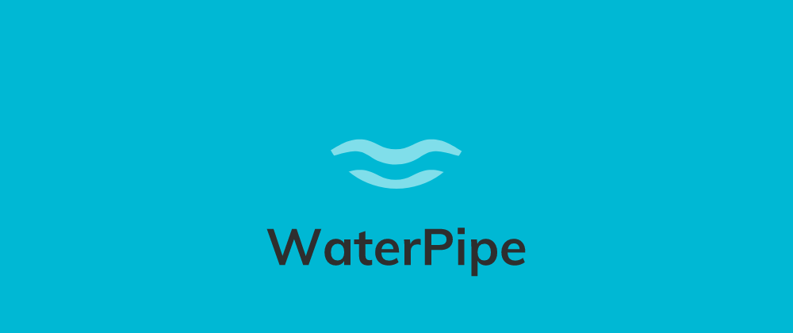

<center>



</center>

# WaterPipe

A powerful routing framework and requests/responses handler for PHP

WaterPipe is a library which allows you to easily handle HTTP requests and responses with PHP, giving you all the power
to build a fully RESTful API, to create a routing framework for your web application, etc...

## Example

```php
<?php

use ElementaryFramework\WaterPipe\WaterPipe;

use ElementaryFramework\WaterPipe\HTTP\Request\Request;

use ElementaryFramework\WaterPipe\HTTP\Response\Response;
use ElementaryFramework\WaterPipe\HTTP\Response\ResponseStatus;
use ElementaryFramework\WaterPipe\HTTP\Response\ResponseHeader;

// Create the root pipe
$root = new WaterPipe;

// Add a new route to the pipe with HTTP GET method (the home page)
$root->get("/", function (Request $req, Response $res) {
    $res->sendHtml("<b>Welcome to my web app !</b> <a href=\"/login\">Click here to login</a>");
});

// Add a new route to the pipe with HTTP GET method (the login page)
$root->get("/login", function (Request $req, Response $res) {
    $res->sendFile("./pages/login.html", ResponseStatus::OkCode);
});

// Add a new route to the pipe with HTTP POST method (the login page form validation)
$root->post("/login", function (Request $req, Response $res) {
    // Get $_POST values
    $body = $req->getBody();
    $username = $body["username"];
    $password = $body["password"];

    if (validate_username($username) && validate_password($password)) {
        // Checks if the client access this route with an AJAX request
        if ($req->isAjax()) {
            $res->sendJson(array(
                "success" => true
            ));
        } else {
            // Redirect the user to the members page
            $res->redirect("/members/{$username}");
        }
    } else {
        // Checks if the client access this route with an AJAX request
        if ($req->isAjax()) {
            $res->sendJson(array(
                "success" => false
            ));
        } else {
            // Redirect the user to the members page
            $res->redirect("/login");
        }
    }
});

// Add a new route to the pipe with HTTP GET method (the member's dashboard page)
$root->get("/members/:username", function (Request $req, Response $res) {
    $res->sendHtml("Welcome to your dashboard <b>{$req->uri['username']}</b> !");
});

// Add a new HTTP error handler (the 404 Not Found Error)
$root->error(ResponseStatus::NotFoundCode, function (Request $req, Response $res) {
    $res->sendText("404 Error: Not Found.", ResponseStatus::NotFoundCode);
});

// Finally... Run the pipe
$root->run();
```

## Features

- Highly designed to quickly create routes for MVC applications and REST services ;
- Object Oriented HTTP [requests](https://github.com/ElementaryFramework/WaterPipe/blob/master/src/WaterPipe/HTTP/Request/Request.php) and [responses](https://github.com/ElementaryFramework/WaterPipe/blob/master/src/WaterPipe/HTTP/Response/Response.php) management ;
- Full support for HTTP methods: GET, POST, PUT, DELETE, HEAD and PATCH ;
- Easily handle common HTTP errors (404, 500, etc...) ;
- Designed to work with frontend frameworks like React.js, AngularJS, Vue.js, etc... with AJAX support

## Installation

You can install **WaterPipe** in your project with [composer](http://getcomposer.org):

```sh
composer require elementaryframework/water-pipe
```

Once installed, you can access the **WaterPipe** api through the `ElementaryFramework\WaterPipe` namespace.

## How to use ?

New to **WaterPipe** ? Learn how to build routing frameworks and REST services by browsing our [wiki](https://github.com/ElementaryFramework/WaterPipe/wiki).

### Additional resources and tutorials

- [How to create a RESTful API with PHP and the Elementary Framework](https://dev.to/na2axl/how-to-create-a-restful-api-with-php-and-the-elementary-framework-30ij) written by @na2axl on dev.to

## License

&copy; Copyright 2018-2019 Aliens Group.

Licensed under MIT ([read license](https://github.com/ElementaryFramework/WaterPipe/blob/master/LICENSE))